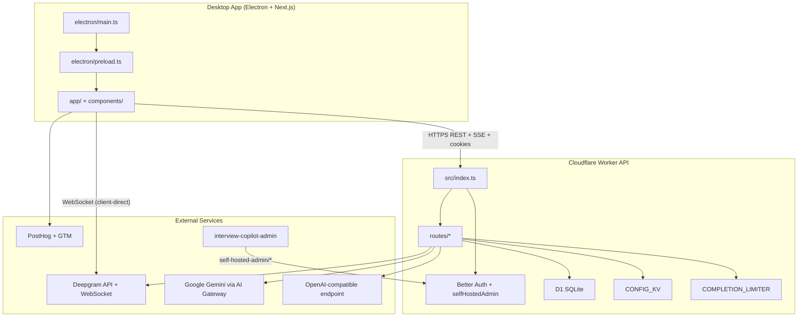
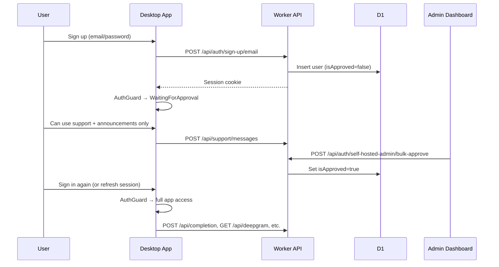
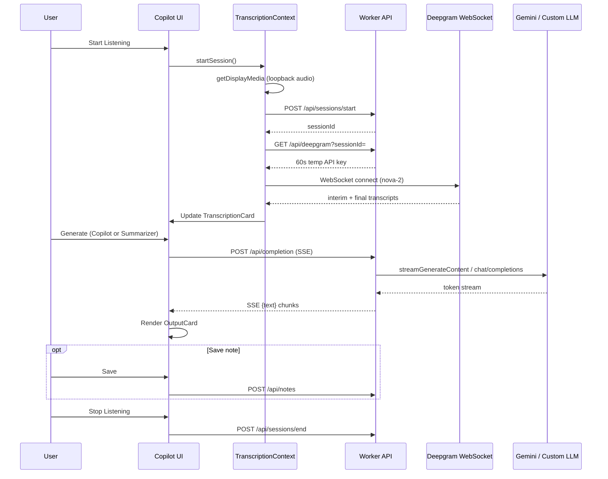
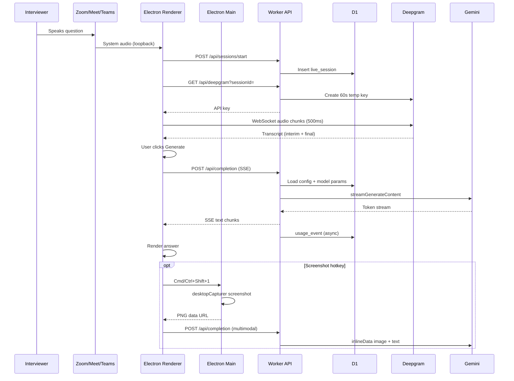

# Realtime Interview Copilot — System Architecture

This document is the single source of truth for how the desktop app, worker API, database, and external services fit together. It covers runtime boundaries, data flows, API surface, security, build, and release behavior.

---

## 1. Executive summary

**Realtime Interview Copilot** is a desktop assistant for live interviews. It captures system audio from video calls (Zoom, Meet, Teams, etc.), transcribes speech in real time via Deepgram, and generates AI answers through Copilot, Summarizer, and Ask AI modes — including screenshot and microphone input. The app runs as an Electron desktop client with a transparent, always-on-top overlay so it stays usable during interviews while remaining hard to capture through normal screen-sharing paths.

The system has four cooperating parts:

| Part | Runtime | Responsibility |
|------|---------|----------------|
| Desktop app | Electron 42, Next.js 16, React 19 | Window management, audio capture, transcription UI, screenshots, hotkeys, worker communication |
| Worker API | Cloudflare Workers | Authentication, token minting, completions, notes, presets, sessions, support, announcements, usage tracking |
| Database | Cloudflare D1 (SQLite) + Drizzle ORM | Users, sessions, config, notes, presets, support threads, announcements, audit data, usage records |
| Admin dashboard | External repo (`interview-copilot-admin/`) on Cloudflare Workers | User approval, config, live sessions, support inbox, usage analytics |

The desktop app never holds long-lived model or Deepgram secrets. Those stay in the worker and are exposed only as short-lived credentials or streamed responses.

### High-level system diagram



**What this system does not use:** Durable Objects, R2 object storage, or worker-owned WebSockets. Real-time transcription uses a **client-direct WebSocket to Deepgram**; AI output uses **HTTP SSE** from the worker.

---

## 2. Repository and package layout

This repository contains **two independent packages** (not a formal npm/Bun workspaces monorepo). A third system — the admin dashboard — lives in a sibling repository.

### Packages in this repo

| Package | Path | Version | Type |
|---------|------|---------|------|
| Desktop app | `/` (root) | `0.12.0-beta` | Electron + Next.js static export |
| Worker API | `realtime-worker-api/` | `0.1.0` | Cloudflare Worker |

**Package manager:** Bun `1.3.10` (root). Production API URL is hardcoded in `lib/constant.ts`:

```
https://realtime-worker-api-prod.vedgupta.in
```

### External system

| System | Location | Deploy target |
|--------|----------|---------------|
| Admin dashboard | Sibling repo `interview-copilot-admin/` | `https://interview-copilot-admin.vedgupta.in` (OpenNext on Cloudflare Workers) |

### Directory map

| Path | Purpose |
|------|---------|
| `app/` | Next.js App Router pages (static export for Electron) |
| `components/` | React UI: copilot, Ask AI, compact overlay, auth, shadcn-style `ui/` |
| `electron/` | Electron main process, preload bridge, IPC, security, auto-updater |
| `hooks/` | Client hooks: transcription, mic, notes, presets, export, click-through |
| `lib/` | Shared client utilities: auth client, SSE, Deepgram session, vision |
| `public/` | Icons, service worker (`sw.js`), static `_headers` |
| `build/` | macOS Electron Builder entitlements plists |
| `scripts/` | Electron compile, Homebrew cask updater, Windows icon generator |
| `realtime-worker-api/` | Cloudflare Worker backend (D1, KV, rate limiting, Better Auth) |
| `homebrew/` | Homebrew cask template synced to `innovatorved/homebrew-tap` by CI |
| `.github/workflows/` | Release CI (Electron builds + GitHub Release + Homebrew tap) |

**Placeholder directories** (admin moved to external repo): `app/admin/`, `components/admin/`, `components/analytics/`, `winget/`.

---

## 3. Runtime architecture

### 3.1 Desktop (Electron + Next.js static export)

#### Process split

The Electron app follows the standard main / preload / renderer separation:

| Layer | File | Role |
|-------|------|------|
| Main process | `electron/main.ts` | `BrowserWindow`, security, hotkeys, IPC handlers |
| Preload | `electron/preload.ts` | `contextBridge` → limited `window.electronAPI` |
| Renderer | `app/`, `components/` | Next.js static-export React UI |

The window is frameless, transparent, always on top, sandboxed, and isolated from Node in the renderer. The UI only gets capabilities exported by preload.

#### Provider tree

`app/layout.tsx` wraps the entire app:

```
AppErrorBoundary
  → PostHogProvider
    → AppBackdropProvider
      → TabProvider
        → TranscriptionProvider
          → TitleBar + {children}
```

#### Main shell

`components/main.tsx` orchestrates the app shell:

- Switches between **Copilot**, **Ask AI**, and **Presets** tabs (Alt+C / Alt+A / Alt+P).
- Manages **compact mode** and click-through overlay behavior.
- Wires saved notes, preset loading, and export.
- Listens for the global capture-and-ask shortcut (`Cmd/Ctrl+Shift+1`).

Key UI surfaces:

| Component | Purpose |
|-----------|---------|
| `components/copilot.tsx` | Live interview Copilot and Summarizer |
| `components/QuestionAssistant.tsx` | Ask AI with screenshot and mic support |
| `components/recorder.tsx` | Live audio capture and transcription controls |
| `components/TranscriptionContext.tsx` | Transcript state and session lifecycle |
| `components/CompactCopilot.tsx` | Compact overlay toolbar mode |
| `components/InterviewPresets.tsx` | Preset templates and background context |
| `components/auth/auth-guard.tsx` | Auth, approval, and ban gate |

#### Build model

- **Production:** `next.config.mjs` sets `output: "export"` → static files in `out/` bundled into Electron.
- **Development:** `bun run electron:dev` — Next.js on port 3000 + Electron loading the dev server.
- **No Next.js server in production** — all backend logic lives in `realtime-worker-api/`.

### 3.2 Worker API

Single HTTP dispatcher at `realtime-worker-api/src/index.ts`:

1. CORS preflight (`OPTIONS`)
2. CSRF origin gate (`originIsTrusted`)
3. Route to handler in `routes/`
4. Fallthrough to Better Auth at `/api/auth/*`

#### Cloudflare bindings (`wrangler.toml`)

| Binding | Type | Purpose |
|---------|------|---------|
| `DB` | D1 (`realtime-interview-copilot-db`) | Primary datastore; Drizzle migrations in `drizzle/` |
| `CONFIG_KV` | KV namespace | Admin config cache, per-user activity throttle |
| `COMPLETION_LIMITER` | Rate limiter | 30 requests / 60 seconds |

#### Scheduled maintenance

Cron trigger `0 3 * * *` (daily 03:00 UTC) runs `runScheduledMaintenance` in `src/lib/maintenance.ts`:

- Deletes expired auth `session` rows and `rate_limit` entries
- Ends stale `live_session` rows (`endedAt IS NULL` and `lastSeenAt` older than 5 minutes)

### 3.3 External services

| Service | Role | Connection |
|---------|------|------------|
| **Deepgram** | Live speech-to-text | Worker mints 60s keys; client opens WebSocket directly |
| **Google Gemini** | Default LLM | Worker streams via Cloudflare AI Gateway |
| **OpenAI-compatible API** | Optional custom LLM | Admin-configured HTTPS endpoint (SSRF-guarded) |
| **PostHog + GTM** | Product analytics | Client-side from renderer |
| **Admin dashboard** | Operations console | Calls `/api/auth/self-hosted-admin/*` on the worker |

---

## 4. Authentication and authorization

### Stack

| Layer | File | Technology |
|-------|------|------------|
| Worker auth | `realtime-worker-api/src/auth.ts` | Better Auth + Drizzle SQLite adapter on D1 |
| Session gate | `realtime-worker-api/src/middleware/auth.ts` | Approval / ban checks per endpoint |
| Client | `lib/auth-client.ts` | `createAuthClient({ baseURL: .../api/auth })` |
| UI gate | `components/auth/auth-guard.tsx` | Loading → login → pending → banned → approved |

### Password handling

Passwords are hashed and verified in worker code (`realtime-worker-api/src/crypto.ts`) using PBKDF2-SHA256 with 100,000 iterations and constant-time comparison.

### Cookie configuration

Cookies use `SameSite=None` and `Secure=true` because the Electron renderer (`file://` or `localhost`) and the Cloudflare Worker are not same-site in the normal browser sense. All API fetches use `credentials: "include"`.

### Approval gate

Users have `isApproved` (default `false`) and `isBanned` (default `false`) on the `user` table. Two auth helpers enforce different policies:

| Function | Approval required | Banned rejected | Used for |
|----------|-------------------|-----------------|----------|
| `getAuthenticatedUser` | Yes | Yes | Billable/sensitive routes (completions, Deepgram, notes, sessions) |
| `getAuthenticatedUserAllowPending` | No | Yes | Support messages, announcements (pending users can contact admins) |

`authErrorResponse` returns HTTP 401 (unauthorized), 403 with `pending_approval`, or 403 with `banned`.

### Auth onboarding flow



### Cross-cutting security on every request

- **CSRF:** `originIsTrusted` in `middleware/csrf.ts` blocks state-changing requests from untrusted origins.
- **CORS:** `middleware/cors.ts` shares `TRUSTED_ORIGINS` with Better Auth.
- **Auth plugin hooks:** Disposable email blocking, IP rate limits on signup/login, ban enforcement, audit logging (`self-hosted-admin` plugin).

---

## 5. Core user flows

### 5.1 Interview Copilot flow

The primary loop: system audio → live transcript → AI answer.



**Step detail:**

1. `AuthGuard` passes → user is on Copilot tab (`components/copilot.tsx`).
2. `RecorderTranscriber` (`components/recorder.tsx`) calls `useTranscription().startSession()`.
3. `lib/transcription/deepgramSession.ts` captures system audio, registers a live session, mints a Deepgram key, opens a WebSocket.
4. `MediaRecorder` emits 500 ms audio chunks to Deepgram once the WebSocket is open.
5. User toggles Copilot vs Summarizer (`FLAGS` in `lib/types.ts`) and hits Generate.
6. `hooks/useCopilotSubmit.ts` POSTs to `/api/completion`; `lib/sse.ts` parses the stream.
7. Optional: Save → `POST /api/notes` via `hooks/useNotes.ts`.

`TranscriptionProvider` is mounted at the layout root so the WebSocket survives compact ↔ full mode switches.

### 5.2 Ask AI flow

Multi-turn chat with optional screenshots and microphone dictation.

| Feature | Client module | Backend |
|---------|---------------|---------|
| Chat | `hooks/useAskChat.ts` | `POST /api/completion` with `messages[]` + optional `image` |
| Screenshot | `hooks/useCaptureAndAsk.ts` + `electron/ipc/screen.ts` | Multimodal completion (Gemini `inlineData` or OpenAI `image_url`) |
| Mic dictation | `hooks/useAskMic.ts` + `hooks/useMicPushToTalk.ts` | `GET /api/deepgram/ask` → separate WebSocket (250 ms chunks) |

**Screenshot hotkey flow:**

1. Main process captures primary display (`desktopCapturer`), downsizes, returns PNG data URL.
2. Renderer receives `screen:capture-and-ask` IPC event.
3. `QuestionAssistant.tsx` or `CompactCopilot.tsx` attaches the image to the next completion request.
4. Worker validates image MIME/size (`lib/vision-screenshot.ts` mirrors server rules).

Ask AI carries a front-end background instruction `ASK_AI_BACKGROUND` sent on the first turn only; screenshot-only requests use `VISION_FALLBACK_PROMPT`.

### 5.3 Compact overlay mode

`components/CompactCopilot.tsx` replaces the full tab layout with a thin toolbar strip:

- **Click-through:** `hooks/useClickThrough.ts` calls `setIgnoreMouseEvents(true, { forward: true })` on the main process. Interactive regions (`.titlebar-chrome`, `.app-toolbar`, `[data-clickable]`) disable ignore so chrome remains grabbable.
- **Window resize:** `hooks/useCompactWindowSize.ts` grows the window when an answer panel or Ask drawer opens.
- **Shared transcription:** Same `TranscriptionProvider` instance — recording does not stop when toggling compact mode.
- **Keyboard:** Mod+Enter generate, Alt+A Ask drawer; tab shortcuts disabled in compact mode (`TabContext.tsx`).

### 5.4 Presets and notes

- **Presets:** `GET /api/presets` via `hooks/usePresets.ts`. Applying a preset sets `presetContext` in `main.tsx` and switches to Copilot.
- **Notes:** CRUD via `hooks/useNotes.ts`. History sidebar in full mode.
- **Export:** `POST /api/export` via `hooks/useExport.ts` (markdown/HTML).

### 5.5 Backdrop opacity

Title bar **− / +** adjusts `backdropOpacity` in `components/AppBackdropContext.tsx` (persisted in `localStorage` on Electron). Published as CSS variable `--app-backdrop-opacity`.

| Surface | Full mode | Compact mode |
|---------|-----------|--------------|
| Full-window fill | `AppBackdrop` rgba layer follows slider | No full-window layer |
| Title bar / toolbars | Minimum opacity floor so chrome stays grabbable | Same |
| Content cards | `.glass-card` mix scales with slider | Output area transparent; text uses light halos |

### 5.6 Auto-update

`electron/updater.ts` wraps `electron-updater` for packaged builds. Title bar download icon triggers `updaterCheck`; status events flow to the renderer via preload. Homebrew cask installs use `brew upgrade --cask` instead of the in-app updater.

---

## 6. Realtime transports

There is **no WebRTC** and **no app-owned WebSocket to the worker**.

| Transport | Used for | Client module | Server endpoint |
|-----------|----------|---------------|-----------------|
| Deepgram WebSocket | Live interview transcription | `lib/transcription/deepgramSession.ts` | Key minted at `GET /api/deepgram` |
| Deepgram WebSocket | Ask AI mic dictation | `hooks/useAskMic.ts` | Key minted at `GET /api/deepgram/ask` |
| HTTP SSE | AI completions (Copilot, Summarizer, Ask AI) | `lib/sse.ts` | `POST /api/completion` |
| REST + cookies | Auth, notes, presets, sessions, support, etc. | Various hooks | `/api/*` |
| Electron IPC | Window, screen capture, click-through, updater | `electron/preload.ts` | N/A (main process) |

### Deepgram connection defaults

`lib/transcription/deepgramLiveConnection.ts` connects with:

- Model: `nova-2` (default)
- `interim_results: true`, `smart_format: true`

| Pipeline | MediaRecorder timeslice |
|----------|-------------------------|
| Interview (system audio) | 500 ms |
| Ask AI mic | 250 ms |

CSP allows `wss://*.deepgram.com` (set in `app/layout.tsx` meta, `electron/security/csp.ts`, and `public/_headers`).

### SSE contract

Worker streams:

```
data: {"text":"..."}\n\n
data: {"error":"..."}\n\n
data: [DONE]\n\n
```

Client parser: `lib/sse.ts` (`parseSseStream`) with carry-buffer for partial frames.

---

## 7. State management (client)

No Redux, Zustand, or global state library. State is React Context + custom hooks.

### Global context

| Context | File | State owned |
|---------|------|-------------|
| `TranscriptionProvider` | `components/TranscriptionContext.tsx` | Live transcript, segments, session state, start/stop |
| `TabProvider` | `components/TabContext.tsx` | `activeTab` (copilot \| ask-ai \| presets), `compactMode` |
| `AppBackdropProvider` | `components/AppBackdropContext.tsx` | Window backdrop opacity |

### Feature hooks

| Hook | Responsibility |
|------|----------------|
| `useCopilotSubmit` | Copilot/Summarizer completion SSE stream |
| `useAskChat` | Multi-turn Ask AI chat |
| `useAskMic` | Mic dictation WebSocket session |
| `useMicPushToTalk` | Space / Ctrl+Space push-to-talk |
| `useNotes` / `usePresets` / `useExport` | CRUD against worker APIs |
| `useCaptureAndAsk` | Global screenshot hotkey wiring |
| `useClickThrough` | Compact overlay mouse passthrough |
| `useCompactWindowSize` | Electron window resize on compact toggle |
| `useAnnouncements` | In-app banners/popups |
| `useSupportMessages` | Support thread UI |

### Persistence

| Storage | Keys / usage |
|---------|--------------|
| `localStorage` | `interview-copilot-compact-mode`, `copilot-backdrop-opacity` |
| `sessionStorage` | Resume/JD context (`bg`), compact completion/chat (`components/compact/storage.ts`) |

### Auth session

`authClient.useSession()` from Better Auth — cookie-based, `credentials: "include"` on all API fetches.

### Telemetry (parallel paths)

- **PostHog** — `components/PostHogProvider.tsx`, event captures in hooks/components
- **GTM** — `sendGTMEvent` in `main.tsx`, `copilot.tsx`
- **Worker events** — `trackEvent()` in `lib/session-tracking.ts` → `POST /api/events/track`

---

## 8. Worker API reference

### 8.1 Public routes

All routes pass through CORS + CSRF origin gate. Legacy aliases without `/api` prefix exist for some endpoints.

| Method | Path | Handler | Auth | Rate limit |
|--------|------|---------|------|------------|
| GET/POST | `/api/deepgram` | `handleDeepgram` | Approved | `COMPLETION_LIMITER` (`deepgram:{userId}`) |
| GET | `/api/deepgram/ask` | `handleDeepgramAsk` | Approved | `COMPLETION_LIMITER` (`deepgram-ask:{userId}`) |
| POST | `/api/completion` | `handleCompletion` | Approved | `COMPLETION_LIMITER` (`userId`) |
| GET | `/api/notes` | `handleGetNotes` | Approved | — |
| POST | `/api/notes` | `handleCreateNote` | Approved | — |
| DELETE | `/api/notes/:id` | `handleDeleteNote` | Approved | — |
| GET | `/api/presets` | `handleGetPresets` | Approved | — |
| POST | `/api/export` | `handleExport` | Approved | — |
| GET | `/api/usage/me` | `handleUsageMe` | Approved | — |
| POST | `/api/sessions/start` | `handleSessionStart` | Approved | `COMPLETION_LIMITER` (`session_start:{userId}`) |
| POST | `/api/sessions/end` | `handleSessionEnd` | Approved | — |
| POST | `/api/sessions/end-all` | `handleSessionEndAll` | Approved | — |
| POST | `/api/events/track` | `handleEventTrack` | Approved | `COMPLETION_LIMITER` (`event_track:{userId}`) |
| GET | `/api/support/messages` | `handleListSupportMessages` | Pending OK | — |
| POST | `/api/support/messages` | `handleCreateSupportMessage` | Pending OK | `COMPLETION_LIMITER` (`support_create:{userId}`) |
| POST | `/api/support/messages/read` | `handleMarkSupportThreadReadByUser` | Pending OK | — |
| GET | `/api/announcements/active` | `handleActiveAnnouncements` | Pending OK | — |
| POST | `/api/announcements/:id/dismiss` | `handleDismissAnnouncement` | Approved | — |
| POST | `/api/announcements/:id/ack` | `handleAckAnnouncement` | Approved | — |
| * | `/api/auth/*` | Better Auth handler | Varies | D1 auth rate limits (plugin) |

`COMPLETION_LIMITER`: 30 requests per 60 seconds per key prefix.

### 8.2 Client → API mapping

| Client file | Endpoint(s) |
|-------------|---------------|
| `lib/auth-client.ts` | `/api/auth/*` |
| `lib/transcription/deepgramSession.ts` | `GET /api/deepgram`, `POST /api/sessions/start`, `POST /api/sessions/end` |
| `lib/session-tracking.ts` | `POST /api/sessions/start`, `/end`, `/end-all`, `POST /api/events/track` |
| `hooks/mic/keyFetch.ts` | `GET /api/deepgram/ask` |
| `hooks/useCopilotSubmit.ts` | `POST /api/completion` |
| `components/compact/useCompactGenerate.ts` | `POST /api/completion` |
| `hooks/useAskChat.ts` | `POST /api/completion` |
| `hooks/useNotes.ts` | `GET/POST/DELETE /api/notes` |
| `hooks/usePresets.ts` | `GET /api/presets` |
| `hooks/useExport.ts` | `POST /api/export` |
| `hooks/useAnnouncements.ts` | `GET /api/announcements/active`, `POST .../dismiss`, `POST .../ack` |
| `hooks/useSupportMessages.ts` | `GET/POST /api/support/messages`, `POST .../read` |

### 8.3 Admin API (`/api/auth/self-hosted-admin/*`)

Mounted as a Better Auth plugin in `realtime-worker-api/src/plugins/self-hosted-admin/`. All endpoints are admin-gated via `isAdmin` (email in `ADMIN_EMAILS` env or D1 `admin_config`).

| Group | Endpoints | File |
|-------|-----------|------|
| Dashboard | `app-config`, `me`, `overview`, `chart-signups`, `health` | `endpoints/dashboard.ts` |
| Users | `list-users`, `get-user`, `update-user`, `delete-user`, `bulk-approve`, `bulk-ban`, `bulk-delete`, `export-users` | `endpoints/users.ts` |
| Auth sessions | `list-sessions`, `revoke-session`, `revoke-all-sessions` | `endpoints/sessions.ts` |
| Config | `config`, `reveal-config`, `update-config`, `test-model`, `openai-config`, `admins` | `endpoints/config.ts` |
| Model params | `model-params`, `user-model-params` | `endpoints/model-params.ts` |
| Live sessions | `live-sessions`, `live-session`, `live-session-terminate` | `endpoints/live-sessions.ts` |
| Support | `support/threads`, `support/thread`, `support/reply`, `support/update-status` | `endpoints/support.ts` |
| Announcements | `announcements`, `announcements/create`, `update`, `delete`, `stats` | `endpoints/announcements.ts` |
| Usage | `usage/summary`, `usage/by-user`, `usage/user`, `usage/events`, `usage/timeseries`, `usage/export.csv` | `endpoints/usage.ts` |
| AI Gateway | `ai-gateway/logs`, `ai-gateway/log`, `ai-gateway/summary`, `providers/health` | `endpoints/ai-gateway-routes.ts` |
| Audit | `audit-logs`, `security-events`, `activity` | `endpoints/audit.ts` |
| Notes/presets | `list-notes`, `delete-note`, preset admin endpoints | `endpoints/notes-presets.ts` |
| Cleanup | `cleanup` | `endpoints/cleanup.ts` |

**External dashboard:** `https://interview-copilot-admin.vedgupta.in`  
Deploy: `NEXT_PUBLIC_API_URL=https://realtime-worker-api-prod.vedgupta.in bun run deploy` (in the admin repo).

**Admin terminate live session:** `adminTerminateLiveSession` revokes the Deepgram key via `DELETE /v1/projects/{projectId}/keys/{keyId}`, dropping the client's WebSocket on the next audio chunk.

### 8.4 Completion pipeline internals

```
handleCompletion (routes/completion.ts)
  → getAuthenticatedUser + rate limit
  → validate prompt/bg/messages/images
  → buildWireMessages (lib/prompt.ts)
  → getCachedConfig + getEffectiveModelParams
  → if cfg.useCustom:
       streamOpenAICompatibleCompletion (routes/completion-openai.ts)
     else:
       streamGeminiCompletion (routes/completion-gemini.ts)
  → TransformStream SSE writer
  → ctx.waitUntil: usage_event insert (usage.ts)
```

**Provider paths:**

| Provider | Endpoint | Auth |
|----------|----------|------|
| Gemini (default) | `https://gateway.ai.cloudflare.com/v1/{accountId}/{gatewayId}/google-ai-studio/v1beta/models/{model}:streamGenerateContent?alt=sse` | `x-goog-api-key` |
| OpenAI-compatible | `{customBaseUrl}/chat/completions` | `Bearer {customApiKey}` |

**Privacy:** `usage_event` stores char counts, model name, duration, and status — **never prompt bodies**.

**Request shapes from client:**

Copilot / Summarizer (`useCopilotSubmit.ts`):
```json
{ "bg": "...", "flag": "copilot"|"summarizer", "prompt": "<transcript>" }
```

Ask AI (`useAskChat.ts`):
```json
{
  "bg": "<ASK_AI_BACKGROUND>",
  "flag": "copilot",
  "prompt": "<latest user text>",
  "image": "<data URL or array>",
  "messages": [{ "role": "user"|"assistant", "text": "...", "images": [...] }]
}
```

### 8.5 Deepgram key minting

Both `handleDeepgram` and `handleDeepgramAsk`:

1. Authenticate approved user
2. Rate limit
3. Load Deepgram project key from D1 config (never from KV cache alone)
4. `GET https://api.deepgram.com/v1/projects` → project ID
5. `POST .../projects/{id}/keys` — 60s TTL, `usage:write` scope
6. Return `{ key }` to client

`handleDeepgram` optionally binds `api_key_id` to `live_session` when `?sessionId=` is provided.

---

## 9. Data model

### 9.1 D1 tables (`realtime-worker-api/src/db/schema.ts`)

| Table | Purpose |
|-------|---------|
| `user` | Accounts; `isApproved`, `isBanned`, `lastActiveAt` |
| `session` | Better Auth sessions |
| `account` | Credential / OAuth links |
| `verification` | Email verification tokens |
| `live_session` | Active recordings; Deepgram key binding; admin terminate target |
| `saved_note` | User-saved interview answers (`content` stored as `body` column) |
| `interview_preset` | Built-in + per-user preset templates |
| `usage_event` | Per-action usage tracking (no prompt bodies) |
| `admin_config` | Key-value runtime config (model keys, feature flags) |
| `user_model_params` | Per-user LLM parameter overrides |
| `support_message` | User ↔ admin support threads |
| `app_announcement` | In-app banners, popups, toasts |
| `app_announcement_dismissal` | Per-user popup dismissal records |
| `audit_event` | Admin audit trail |
| `security_event` | Security incidents (failed logins, disposable email blocks) |
| `rate_limit` | Auth rate limiting (signup/login windows) |

**Migrations:** `realtime-worker-api/drizzle/` (`0000`–`0009`).

### 9.2 Live session lifecycle

| Event | Handler | Effect |
|-------|---------|--------|
| Start listening | `handleSessionStart` | Insert `live_session`; auto-evict oldest if >3 concurrent per user |
| Stop listening | `handleSessionEnd` | Set `endedAt`, `endedBy: "user"` |
| Crash recovery | `handleSessionEndAll` | Bulk-end all active sessions for user (idempotent) |
| Client telemetry | `handleEventTrack` | Allow-listed actions → `usage_event` + bump `live_session.eventCount` |
| Cron maintenance | `runScheduledMaintenance` | End stale sessions (`lastSeenAt` > 5 min ago) |
| Admin terminate | `adminTerminateLiveSession` | Revoke Deepgram key → WS dies; optionally revoke auth sessions |

### 9.3 KV usage (`CONFIG_KV`)

Registry: `realtime-worker-api/src/kv-keys.ts`

| Key pattern | TTL | Purpose |
|-------------|-----|---------|
| `admin_config:v1` | 5 min | Non-secret admin config cache (`config-cache.ts`) |
| `activity:{userId}` | 5 min | Throttle `lastActiveAt` D1 writes |

Secrets (Gemini key, Deepgram key, custom API key) are **always loaded from D1** even when KV cache hits — never stored in KV.

### 9.4 Config resolution

`config-cache.ts` — `getCachedConfig`, `getEffectiveModelParams`

Priority: D1 `admin_config` → env vars (`GOOGLE_GENERATIVE_AI_API_KEY`, `DEEPGRAM_API_KEY`, `GEMINI_MODEL`, `CF_*`) → defaults.

---

## 10. Security model

### 10.1 Window hardening

`electron/main.ts`:

- `contextIsolation: true`, `sandbox: true`, `nodeIntegration: false`
- `setContentProtection(true)` reduces OS screen-recording capture
- macOS: `setSharingType("none")`, `setVisibleOnAllWorkspaces(true, { visibleOnFullScreen: true })`
- Navigation locked to trusted origins; external links open in default browser

### 10.2 CSP and origin checks

CSP is set in three layers that must stay in lockstep:

1. `electron/security/csp.ts` — Electron dev header (allows `unsafe-eval` for React dev)
2. `app/layout.tsx` meta tag — production static export (no `unsafe-eval`)
3. `public/_headers` — static hosting fallback

Worker enforces `TRUSTED_ORIGINS` via CSRF gate and CORS.

### 10.3 Preload API surface

`electron/preload.ts` exposes only:

- Window controls (minimize, maximize, close, always-on-top, resize, ignore mouse events, focus)
- App lifecycle (quit, relaunch, auto-update)
- Screen capture (access checks, macOS permission prompt, screenshot, capture-and-ask events)
- Platform flags (`platform`, `isElectron`, `supportsSystemAudio`)

No filesystem, shell, or arbitrary IPC access.

### 10.4 Audio and screenshot capture

**System audio (no virtual drivers):**

`electron/security/permissions.ts`:

- `setDisplayMediaRequestHandler` returns primary screen with `audio: "loopback"`
- Renderer uses `getDisplayMedia({ video: true, audio: true })`, stops video track, keeps audio

**macOS permissions:**

- Screen recording: `components/ScreenRecordingOnboard.tsx`, `screen:trigger-prompt`, `screen:open-settings` IPC
- Microphone (Ask AI): `systemPreferences.askForMediaAccess("microphone")` at startup; `com.apple.security.device.audio-input` entitlement in `build/entitlements.mac.plist`

**Screenshots:** `electron/ipc/screen.ts` — primary display capture, downsize, PNG data URL. Hotkey `Cmd/Ctrl+Shift+1` → `screen:capture-and-ask`.

### 10.5 Worker defenses

| Layer | Implementation |
|-------|----------------|
| CSRF | `originIsTrusted` blocks cross-site POSTs from untrusted origins |
| CORS | Shared `TRUSTED_ORIGINS` with Better Auth |
| Auth gate | Approved + non-banned for billable routes |
| Rate limits | CF `COMPLETION_LIMITER` (30/min) + D1 auth rate limits in admin plugin |
| SSRF | `validateOutboundUrl` on custom model URLs (`url-guard.ts`) |
| Secrets | Never in desktop app; Deepgram keys 60s TTL |
| Passwords | PBKDF2-SHA256, 100k iterations, constant-time verify |
| Images | Validated data URLs and size bounds; `rehype-sanitize` on rendered markdown |
| HTTPS | All production remote calls use HTTPS |

### 10.6 Operational privacy

Prompt text, API keys, and PII should not be logged. `usage_event` stores metadata only. `PRIVACY.md` is the user-facing data handling policy.

---

## 11. Infrastructure and deployment

| Component | Deploy target | CI |
|-----------|---------------|-----|
| Desktop app | GitHub Releases (DMG/ZIP/EXE) + Homebrew cask | `.github/workflows/release.yml` (tags `v*`) |
| Worker API | Cloudflare Workers (`wrangler deploy`) | Manual only |
| Admin dashboard | Cloudflare Workers (external repo) | External |

### Distribution channels

| Platform | Channel |
|----------|---------|
| macOS | GitHub Releases + `brew install --cask realtime-interview-copilot` |
| Windows | GitHub Releases (NSIS installer) |
| Linux | electron-builder targets configured (AppImage, deb) but not in default release matrix |

### Worker deployment

```bash
cd realtime-worker-api
bun run deploy   # wrangler deploy
```

Secrets via `wrangler secret put` or `.dev.vars` locally (see `realtime-worker-api/.dev.vars.example`).

---

## 12. Build and release pipeline

### 12.1 Local development

| Command | Effect |
|---------|--------|
| `bun run electron:dev` | Compile Electron TS, start Next.js on :3000, launch Electron |
| `bun run electron:debug` | Same + DevTools auto-open |
| `bun run electron:build` | Compile Electron, `next build`, `electron-builder` |
| `cd realtime-worker-api && bun run dev` | `wrangler dev` for local worker |

### 12.2 Electron compilation

`scripts/build-electron.js` compiles `electron/**/*.ts` → `electron/*.js` via `tsconfig.electron.json`.

### 12.3 Packaging targets

Configured in root `package.json` `build` section:

- macOS: `dmg`, `zip`
- Windows: `nsis`
- Linux: `AppImage`, `deb`

macOS entitlements (`build/entitlements.mac.plist`) include `com.apple.security.device.audio-input` for microphone privacy settings.

### 12.4 Release CI (`.github/workflows/release.yml`)

**Triggers:** tags `v*`, or manual `workflow_dispatch`.

**Jobs:**

1. **build** (matrix: `macos-14`, `windows-latest`) — Bun install, electron compile, Next build, `electron-builder`, macOS mic entitlement verification, artifact upload
2. **release** — GitHub Release with auto-generated notes
3. **tap** — regenerates Homebrew cask via `scripts/update-homebrew-cask.js`, pushes to `innovatorved/homebrew-tap`

### 12.5 Homebrew cask

`homebrew/Casks/realtime-interview-copilot.rb` synced on each release. Users update with `brew upgrade --cask realtime-interview-copilot`.

---

## 13. End-to-end reference diagram

Full path for a single interview question with optional screenshot:



From the user's perspective this is one assistant experience. Under the hood it is a chain of tightly scoped components with explicit trust boundaries.

---

## 14. Reference file index

### Desktop entry points

| File | Role |
|------|------|
| `electron/main.ts` | Main process |
| `electron/preload.ts` | Preload bridge |
| `app/layout.tsx` | Root layout + providers |
| `app/page.tsx` | Home → AuthGuard → MainPage |
| `components/main.tsx` | App shell orchestrator |

### Desktop features

| File | Role |
|------|------|
| `components/copilot.tsx` | Copilot tab |
| `components/QuestionAssistant.tsx` | Ask AI tab |
| `components/CompactCopilot.tsx` | Compact overlay |
| `components/TranscriptionContext.tsx` | Transcription state |
| `components/recorder.tsx` | Start/stop listening |
| `components/auth/auth-guard.tsx` | Auth gate |
| `components/ScreenRecordingOnboard.tsx` | macOS screen permission UX |
| `components/AppBackdropContext.tsx` | Backdrop opacity |
| `hooks/useClickThrough.ts` | Compact click-through |
| `hooks/useCopilotSubmit.ts` | Copilot SSE submit |
| `hooks/useAskChat.ts` | Ask AI chat |
| `hooks/useAskMic.ts` | Mic dictation |
| `hooks/useMicPushToTalk.ts` | Push-to-talk |
| `hooks/useNotes.ts` | Notes CRUD |
| `hooks/usePresets.ts` | Presets fetch |
| `hooks/useExport.ts` | Export |
| `lib/auth-client.ts` | Better Auth client |
| `lib/constant.ts` | Backend API URL |
| `lib/sse.ts` | SSE parser |
| `lib/vision-screenshot.ts` | Screenshot validation |
| `lib/session-tracking.ts` | Live session + events |
| `lib/transcription/deepgramSession.ts` | Interview transcription pipeline |
| `lib/transcription/deepgramLiveConnection.ts` | Deepgram WebSocket helpers |

### Electron IPC and security

| File | Role |
|------|------|
| `electron/ipc/screen.ts` | Screenshot + permissions |
| `electron/ipc/window.ts` | Window controls |
| `electron/ipc/app.ts` | App lifecycle |
| `electron/security/permissions.ts` | Loopback audio handlers |
| `electron/security/csp.ts` | Content security policy |
| `electron/updater.ts` | Auto-update |
| `build/entitlements.mac.plist` | macOS entitlements |

### Worker API

| File | Role |
|------|------|
| `realtime-worker-api/src/index.ts` | Request dispatcher |
| `realtime-worker-api/src/auth.ts` | Better Auth setup |
| `realtime-worker-api/src/middleware/auth.ts` | Session + approval gate |
| `realtime-worker-api/src/middleware/cors.ts` | CORS |
| `realtime-worker-api/src/middleware/csrf.ts` | Origin gate |
| `realtime-worker-api/src/db/schema.ts` | Drizzle schema |
| `realtime-worker-api/src/config-cache.ts` | Config + KV cache |
| `realtime-worker-api/src/kv-keys.ts` | KV key registry |
| `realtime-worker-api/src/usage.ts` | Usage tracking |
| `realtime-worker-api/src/lib/maintenance.ts` | Cron maintenance |
| `realtime-worker-api/src/lib/prompt.ts` | Copilot/Summarizer prompts |
| `realtime-worker-api/src/routes/completion.ts` | Completion dispatcher |
| `realtime-worker-api/src/routes/completion-gemini.ts` | Gemini streaming |
| `realtime-worker-api/src/routes/completion-openai.ts` | OpenAI-compatible streaming |
| `realtime-worker-api/src/routes/deepgram.ts` | Deepgram key minting |
| `realtime-worker-api/src/routes/sessions.ts` | Live session lifecycle |
| `realtime-worker-api/wrangler.toml` | Worker bindings + cron |

### Admin plugin

| File | Role |
|------|------|
| `realtime-worker-api/src/plugins/self-hosted-admin/index.ts` | Plugin entry |
| `realtime-worker-api/src/plugins/self-hosted-admin/endpoints/users.ts` | User management |
| `realtime-worker-api/src/plugins/self-hosted-admin/endpoints/live-sessions.ts` | Live session admin |
| `realtime-worker-api/src/plugins/self-hosted-admin/endpoints/config.ts` | Runtime config |
| `realtime-worker-api/src/plugins/self-hosted-admin/endpoints/usage.ts` | Usage analytics |
| `realtime-worker-api/src/plugins/self-hosted-admin/endpoints/support.ts` | Support inbox |
| `realtime-worker-api/src/plugins/self-hosted-admin/endpoints/announcements.ts` | Announcements admin |
| `realtime-worker-api/src/plugins/self-hosted-admin/endpoints/ai-gateway-routes.ts` | AI Gateway logs |

### CI and release

| File | Role |
|------|------|
| `.github/workflows/release.yml` | Release pipeline |
| `scripts/build-electron.js` | Electron TS compile |
| `scripts/update-homebrew-cask.js` | Homebrew cask updater |
| `homebrew/Casks/realtime-interview-copilot.rb` | Cask template |
